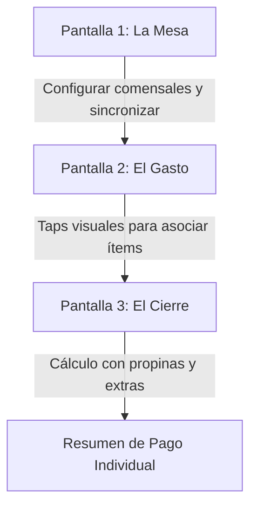

# MitiMiti – El calculador inteligente

> **MitiMiti** es una aplicación móvil multiplataforma (Android & iOS) diseñada para dividir los gastos de una comida en grupo de forma instantánea, fluida y sin matemáticas complejas.

---

## 🍽️ El Problema Real vs Nuestra Innovación

### El Problema
Las aplicaciones de finanzas personales o gastos compartidos tradicionales (como Splitwise) están pensadas para cuentas a largo plazo o recurrentes (viajes, convivencias, departamentos). Exigen registrarse, crear grupos permanentes y configurar flujos complejos. 
**No hay una solución ágil y espontánea (B2C)** que resuelva el momento exacto en la mesa cuando:
* Uno solo tomó agua y otro tres cervezas.
* Alguien no comió postre.
* Hay que calcular la propina (ej. 10%) o extras fijos (como el servicio de mesa o cubiertos) y distribuirlos de forma proporcional o equitativa al consumo real de cada comensal.

### La Innovación de MitiMiti
MitiMiti elimina la fricción mediante un flujo ultra rápido estructurado en **3 pantallas clave**:



1. **Pantalla 1 (La Mesa):** El usuario crea una mesa temporal (que se sincroniza en tiempo real usando Firebase). Añade los nombres de los comensales de manera ultra rápida.
2. **Pantalla 2 (El Gasto):** Una lista donde se registran los ítems del ticket (ej: *"Pizza Grande $12000"*, *"Cerveza $3000"*). Mediante un sistema de toques visuales (taps) sumamente fluidos, el usuario selecciona qué comensales compartieron cada ítem para dividir su costo de manera exacta.
3. **Pantalla 3 (El Cierre):** Muestra el resumen con lo que debe pagar cada persona. Permite aplicar un porcentaje de propina dinámico (ej: 10%) o cargos adicionales fijos de forma proporcional al consumo.

---

## 🏗️ Arquitectura del Proyecto: Hexagonal (Ports & Adapters)

MitiMiti implementa **Arquitectura Hexagonal** en su código compartido (`shared`) para aislar completamente la lógica de negocio de los detalles tecnológicos e interfaces de usuario.

```
                  ┌───────────────────────────────┐
                  │          presentation         │
                  │   (Compose / SwiftUI / UI)    │
                  └───────────────┬───────────────┘
                                  │ (Usa)
                                  ▼
    ┌───────────────────────────────────────────────────────────┐
    │ shared (:shared)                                          │
    │                                                           │
    │         ┌───────────────────────────────────────┐         │
    │         │ domain (Core / Hexágono Interno)      │         │
    │         │                                       │         │
    │         │   [Entidades de Dominio]              │         │
    │         │   (Mesa, Comensal, ItemGasto)         │         │
    │         │                                       │         │
    │         │   [Casos de Uso]                      │         │
    │         │   (CalcularCierreUseCase, etc.)       │         │
    │         │                                       │         │
    │         │   [Puertos / Ports] (Interfaces)      │         │
    │         │   - MesaRepository                    │         │
    │         │   - RealtimeSyncPort                  │         │
    │         └───────────────────▲───────────────────┘         │
    │                             │                             │
    │                    (Implementado por)                     │
    │                             │                             │
    │         ┌───────────────────┴───────────────────┐         │
    │         │ data / adapters (Hexágono Externo)    │         │
    │         │                                       │         │
    │         │   [Adaptadores / Adapters]            │         │
    │         │   - FirebaseRealtimeSyncAdapter       │         │
    │         │   - InMemoryMesaRepositoryAdapter     │         │
    │         └───────────────────────────────────────┘         │
    └───────────────────────────────────────────────────────────┘
```

### Componentes de la Arquitectura
* **Core/Domain (Domain Layer):**
  * **Entidades:** Modelos de datos de negocio puros (`Mesa`, `Comensal`, `ItemGasto`, `CierreCuenta`) escritos en Kotlin puro sin dependencias de frameworks ni anotaciones de bases de datos.
  * **Casos de Uso (Use Cases):** Contienen las reglas y cálculos (ej. cómo prorratear la propina y los extras sobre la cuenta consumida).
  * **Puertos de Entrada (Driver Ports):** Interfaces que definen los casos de uso disponibles para la UI.
  * **Puertos de Salida (Driven Ports):** Interfaces que definen lo que el dominio necesita del mundo exterior (ej. guardar datos o sincronizar en tiempo real).
* **Adaptadores (Adapters Layer):**
  * **Adaptadores de Entrada (Primary/Driver Adapters):** La capa de presentación (`androidApp` con Jetpack Compose e `iosApp` con SwiftUI) que interactúa con los casos de uso del dominio.
  * **Adaptadores de Salida (Secondary/Driven Adapters):** Implementan las interfaces de los puertos de salida (ej. integración real con Firebase, bases de datos locales o mocks para pruebas).

---

## 🔀 Flujo de Trabajo (GitFlow)

El desarrollo del proyecto se realiza de forma estrictamente ordenada utilizando **GitFlow** y verificaciones automatizadas.

### Ramas Protegidas
* `main`: Producción. Solo recibe fusiones estables de `develop`.
* `develop`: Integración. Rama base para el desarrollo diario de nuevas características.

### Ramas de Trabajo
Cualquier cambio debe realizarse en una rama específica con la siguiente nomenclatura según su propósito:
* `🚀 feature/nombre-tarea`: Desarrollo de nuevas funcionalidades.
* `🐛 fix/nombre-error`: Corrección de fallas.
* `⚙️ chore/configuracion`: Actualizaciones de Gradle, dependencias o tareas de mantenimiento.
* `♻️ refactor/nombre-cambio`: Reorganización de código sin alterar su comportamiento.
* `📝 docs/nombre-documento`: Cambios en la documentación o README.
* `🧪 test/nombre-pruebas`: Creación o modificación de pruebas unitarias/integración.

### Reglas para Pull Requests (PR)
Para fusionar una rama en `develop`, debe pasar el pipeline de integración continua (**GitHub Actions**):
1. **Formato y Estilo:** Cumplir con las reglas de estilo de Kotlin ejecutando `./gradlew ktlintCheck`.
2. **Pruebas Unitarias:** Pasar todas las pruebas sin errores (`./gradlew :shared:allTests`).
3. **Android Lint:** No poseer advertencias graves de Android Lint (`./gradlew lint`).
4. **Semántica de Commits:** El título del PR y los commits deben cumplir con **Conventional Commits** (ej: `feat(shared): add calculate bill logic`, `fix(ui): solve alignment issue`).

---

## 🛠️ Herramientas y Scripts Locales

Para facilitar el desarrollo y asegurar la calidad antes de subir cambios, disponemos de los siguientes utilitarios en la raíz:

### 1. Verificación Local del PR (`./pr-check.sh` / `gradlew prCheck`)
Ejecuta la misma suite de calidad que la integración continua (CI) en tu máquina local:
```bash
./pr-check.sh
```
*Este script formatea el código con `ktlintFormat`, ejecuta pruebas unitarias de todos los módulos, corre el análisis de Android Lint y genera el reporte de cobertura.*

### 2. Ejecución Automatizada del Emulador (`./run-app.sh`)
Inicia el emulador de Android configurado por defecto, espera a que cargue, compila la aplicación, la instala en el dispositivo y la ejecuta automáticamente:
```bash
./run-app.sh
```

---

## 🤖 Skills del Asistente de IA (Agent Skills)

Este repositorio está configurado con **Skills** especializadas que guían y restringen el comportamiento de los agentes de IA (como Antigravity) para garantizar la consistencia en el diseño y los estándares del proyecto.

Cualquier agente que trabaje en este repositorio tiene acceso local a estas guías de desarrollo ubicadas en `~/.agents/skills/`.

### Skills Disponibles y Cómo Invocarlas

| Nombre de la Skill | Ubicación Local | Propósito y Cuándo Usarla |
|:---|:---|:---|
| **`compose-multiplatform-patterns`** | `~/.agents/skills/compose-multiplatform-patterns/SKILL.md` | Guías sobre arquitectura de UI compartida con ViewModels de KMP, control de recomposiciones, inyección de dependencias con Koin, y estructuración de componentes visuales responsivos. |
| **`android-clean-architecture`** | `~/.agents/skills/android-clean-architecture/SKILL.md` | Estándares para el flujo de datos entre las capas de presentación, dominio y datos, uso de mappers e inversión de dependencias. |
| **`kotlin-coroutines-flows`** | `~/.agents/skills/kotlin-coroutines-flows/SKILL.md` | Patrones de concurrencia estructurada, uso de `StateFlow`, `SharedFlow` para eventos de un solo uso y buenas prácticas en operaciones asíncronas. |
| **`kotlin-multiplatform-expect-actual`** | `~/.agents/skills/kotlin-multiplatform-expect-actual/SKILL.md` | Buenas prácticas para aislar llamadas al sistema de Android e iOS sin ensuciar el código común (`commonMain`). |
| **`android-native-dev`** | `~/.agents/skills/android-native-dev/SKILL.md` | Reglas de estilo y desarrollo para la aplicación nativa de Android, guías de Material Design 3, y manejo seguro de nulos. |
| **`swiftui-patterns`** | `~/.agents/skills/swiftui-patterns/SKILL.md` | Patrones de diseño modernos de SwiftUI para iOS utilizando el patrón Model-View, manejo de estados con `@Observable`, y ciclo de vida de tareas asíncronas. |

*Para que la IA consuma una skill durante el desarrollo, simplemente debe leer el archivo de la skill usando la herramienta de visualización de archivos:*
```json
{
  "AbsolutePath": "~/.agents/skills/compose-multiplatform-patterns/SKILL.md"
}
```